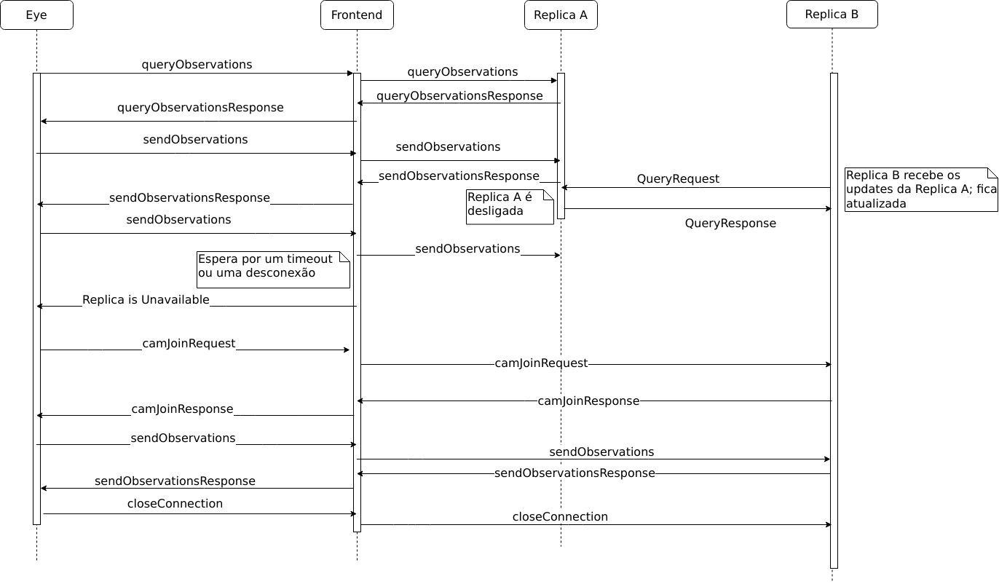
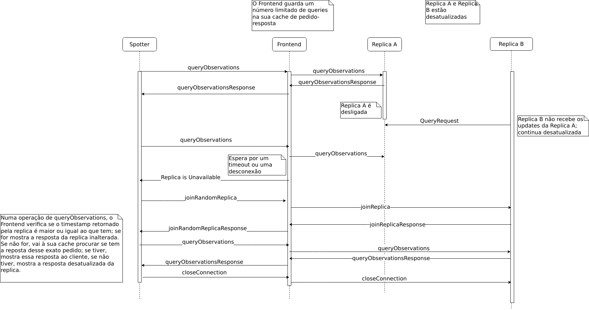
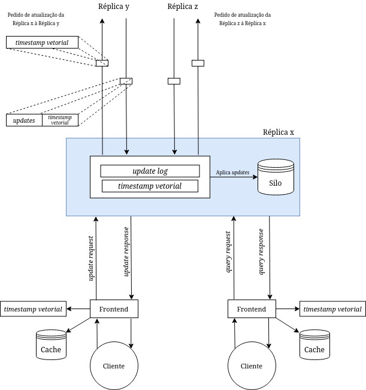

# Relatório do projeto Sauron

Sistemas Distribuídos 2019-2020, segundo semestre

## Autores

**Grupo A01**

| Número | Nome              | Utilizador                       | Correio eletrónico                           |
| -------|-------------------|----------------------------------| ---------------------------------------------|
| 89408  | André Silva       | <https://github.com/andre15silva>| <mailto:andre.a.n.silva@tecnico.ulisboa.pt>  |
| 89418  | Bernardo Conde    | <https://github.com/BassLC>      | <mailto:bernardoconde@tecnico.ulisboa.pt>    |
| 89514  | Nuno Saavedra     | <https://github.com/Nfsaavedra>  | <mailto:nuno.saavedra@tecnico.ulisboa.pt>    |

  

## Melhorias da primeira parte

- [Completar *test coverage* do *camJoin*](https://github.com/tecnico-distsys/A01-Sauron/commit/066d97b876aeee43c698da276b4df647b9f4ab67)
- [Completar *test coverage* do *track*](https://github.com/tecnico-distsys/A01-Sauron/commit/f44ac1194a3fcdcfc8200b707ee8d603ccba4168)
- [Separação domínio-apresentação](https://github.com/tecnico-distsys/A01-Sauron/commit/0115edccb62171101235968f271a7db9aa88c7fe)
- [Ordem no spot \*](https://github.com/tecnico-distsys/A01-Sauron/commit/d211efa97a894586fa125b4fdb2b59885344448d#diff-781a33c089feb1b4b74da871c8f53447)
- [Comentários relevantes e código limpo](https://github.com/tecnico-distsys/A01-Sauron/commit/b5a85f9854229cab7fc69ab337ea8ddc5215e240)

## Modelo de faltas
Faltas/Falhas toleradas:
- Faltas do protocolo de comunicação entre réplicas.
- Falhas transientes silenciosas de uma ou mais réplicas.

Faltas/Falhas não toleradas:
- Falha definitiva do servidor de nomes.
- Falhas bizantinas das réplicas.
- Falhas definitivas das réplicas.
- Camêras com nome igual e coordenadas diferentes registadas em réplicas diferentes não sincronizados entre si.

## Solução

A nossa solução é uma variante do *Gossip protocol*, adaptado às características das operações suportadas pelos servidores.

Consideramos as seguintes condições:
 * Não existem dependências causais entre observações
 * Existem dependências causais entre o registo de uma câmera e as observações dessa câmera

Para simplificar o protocolo a implementar, e garantir que a coerência entre as dependências causais é mantida, sempre que o eye regista uma observação numa réplica x garantimos que esse mesmo eye fez, no processo de ligação a esta réplica, o registo da câmera que representa.
Deste modo podemos executar todos os *updates* no momento da receção, sejam eles provenientes de um cliente ou de uma réplica, eliminando a complexidade inerente à manutenção da coerência proveninente das dependências causais, garantindo, ao mesmo tempo, que toleramos falhas transientes silenciosas de uma réplica que não tenha propagado o registo desse *eye*.

Cada réplica tem, por isso, apenas um *timestamp vetorial*, que representa o seu estado atual, e que é atualizado sempre que recebe um *update*.
Periodicamente é realizado um pedido de *updates* a um número pré-definido de réplicas, sendo estas réplicas escolhidas ao acaso. Cada pedido contem o *timestamp vetorial* do requerente no momento do pedido, e é retornado um conjunto de *updates* que permitem ao requerente atualizar o seu estado. É assim realizada a atualização de réplicas entre si.

De modo a garantir, até um certo limite, a coerência nas leituras por um cliente, o *SiloFrontend* tem, também, um *timestamp vetorial*, que representa o estado visto até esse momento pelo cliente.
Sempre que é feita uma leitura, é comparado o *timestamp vetorial* retornado pela réplica contactada com o *timestamp vetorial* guardado.
Se este representar um estado mais recente e o pedido se encontrar em cache, é apresentado ao utilizador o resultado guardado em cache.
Caso contrário é apresentado o resultado devolvido pela réplica.

A cache corresponde a uma cache Pedido-Resposta, onde o resultado de operações executas pelo spotter e respondidas pelo servidor são guardadas. Esta cache tem um limite de tamanho pré-definido, pelo que não é garantida a coerência de leituras que entretando sejam descartadas da cache. Como se trata de uma cache Pedido-Resposta, operações que deveriam mostrar informação já vista pelo cliente, mas que correspondem a um pedido ainda não feito, não irão representar essa informação.

As seguintes figuras resumem a nossa solução:

Esta solução é tolerante a faltas do protocolo de comunicação uma vez que os *updates* apenas são aplicados numa dada réplica caso a mensagem seja recebida na íntegra. 
Caso exista uma falta no protocolo de comunicação, a mensagem não irá ser aceite e, por isso, rejeitados os *updates*.

A tolerância a faltas transientes provém da propagação de *updates* entre réplicas. Caso uma réplica tenha uma falha das duas uma:
 * Se todo o seu estado já tiver sido propagado, são toleradas tanto falhas transientes como definitivas.
 * Se parte do seu estado ainda não tiver sido propragado, são apenas toleradas falhas transientes, pois quando a falha terminar poderá novamente propagar.

## Protocolo de replicação

Na interação réplica-réplica, é implementado uma variante do protocolo
`Gossip`, com um modelo de `Pull`. Tendo duas réplicas, A e B, em que A quer
ficar coerente com B, acontece o seguinte:

1. A envia a B um `QueryReplicaRequest`, com o seu _timestamp vetorial_.
2. B recebe este pedido e calcula todos os `Updates` que tem que estima que
A não tem.
3. B envia um `QueryReplicaResponse` a B, que contem a lista de `Updates` e o
_timestamp vetorial_ de B.
4. A recebe o pedido, ordena a lista de `Updates` e, por fim, aplica-os um a um.

Cada `Update` é constituído por:
- Um `UpdatePair`, um par composto pelo `replicaId` que inicialmente criou este
update, e pelo _timestamp vetorial_ na altura da criação. É um identificador único de cada *update*.
- Um `Object`, que pode ser ou uma `Camera` ou uma `Observation`.

Cada réplica recebe um `queryInterval`, o tempo em segundos para iniciar a
operação descrita em cima. Cada réplica faz um pedido de `QueryRequest` a um número pré-definido de réplicas, ou a todas as réplicas caso o pré-definido seja igual ou superior.

## Opções de implementação
Na implementação do *Gossip*, escolhemos implementar um modelo _Push_ em vez de um modelo _Pull_, devido à simplicidade de implementação da parte do `Cliente` (em vez de implementar dois tipos de mensagens para interações réplica-réplica e cliente-réplica, podemos implementar a interação réplica-réplica através da extensão da interação cliente-réplica).

Devido à falta de dependências causais (descrita em cima), todos os `Updates` podem ser imediatamente executados em cada Réplica, não sendo necessário a existência de um log de espera, permitindo que as atualizações sejam feitas imediatamente.

Para garantir a coerência, escolhemos implementar uma _cache pedido-resposta_ com um tamanho predefinido no lado do `Frontend`. Esta mostrou-se ser uma resposta simples a este problema, devido a não ser necessário implementar lógica, do lado do `Cliente`, para lidar com a construção de resposta aos pedidos.

## Notas finais
Nada a acrescentar.
